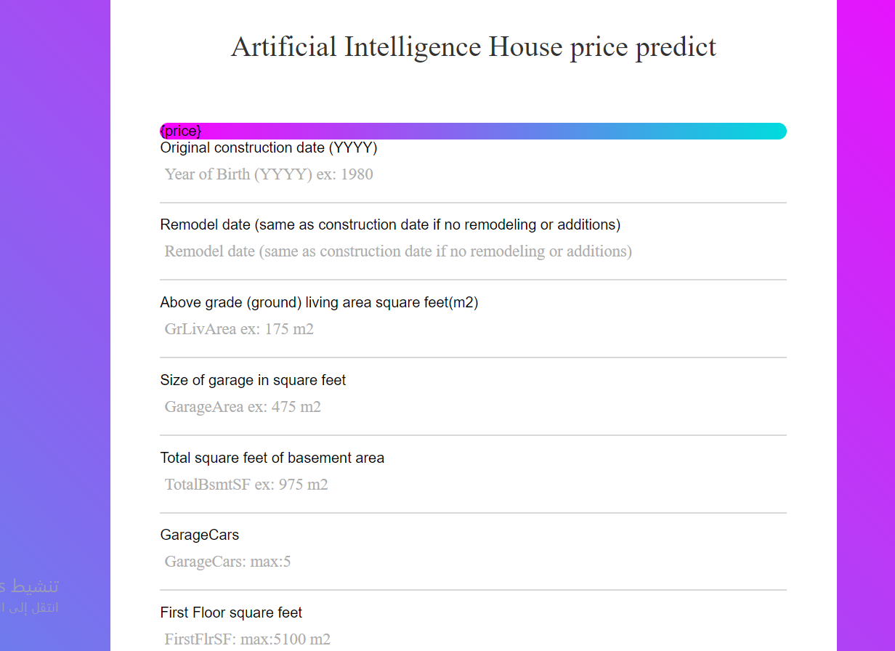

# House-price-Forecasting
Predict the price of the house based on 20 features of the house that are concerned with size, quality, year of construction, etc. Using more than one algorithm to predict a high integer ratio such as decision trees, xgb and others

 
 
# notebook
- [jupyter notebook](https://github.com/abduallheid/House-price-Forecasting/blob/main/final%20project%20predict%20price%20house.ipynb)
